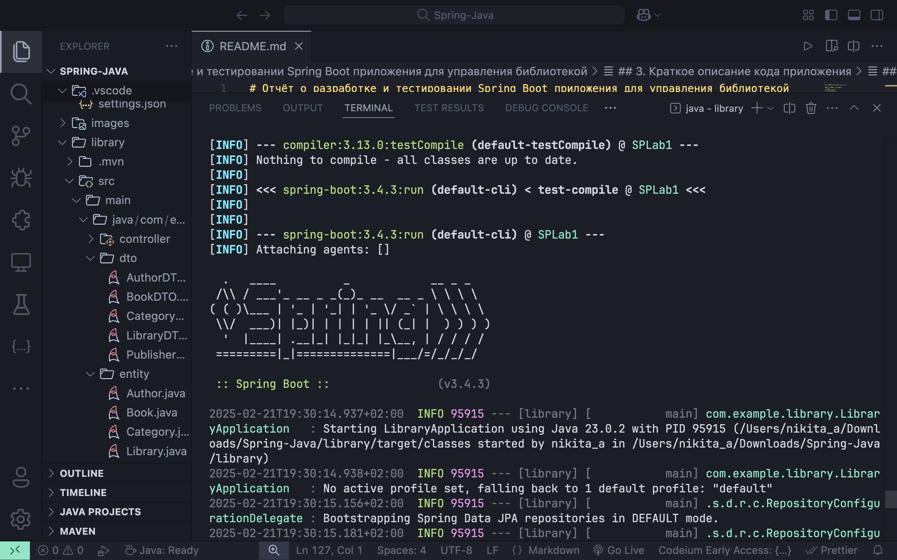
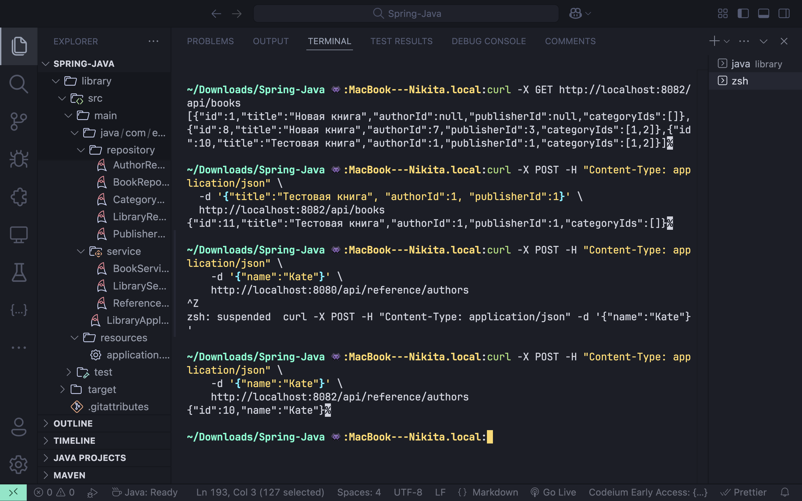
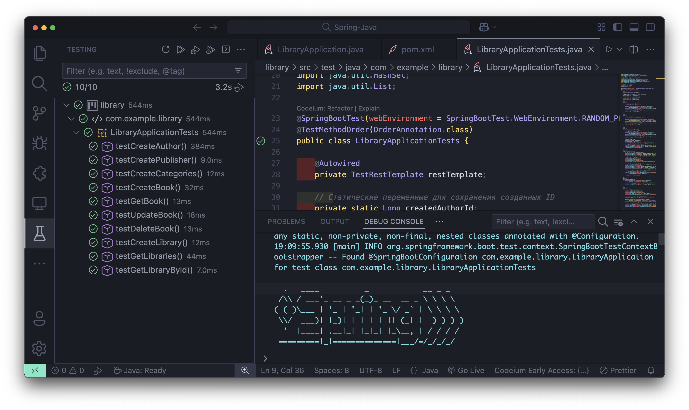
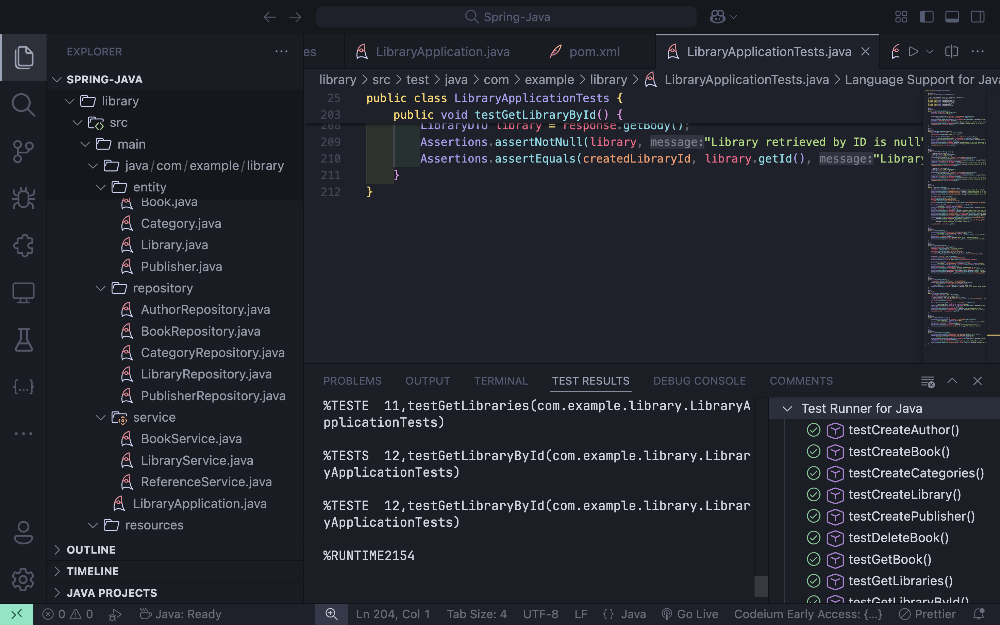

# Отчёт о разработке и тестировании Spring Boot приложения для управления библиотекой

**Автор отчёта:** Никита Савка 

**Дата:** 20 февраля 2025  

**Ccылка на репозиторий:** https://github.com/NikitaBytes/Spring-assignments/blob/main/lab1_basics

---

## Содержание
1. [Введение](#1-введение)
2. [Структура проекта](#2-структура-проекта)
3. [Краткое описание кода приложения](#3-краткое-описание-кода-приложения)
4. [Подготовка к запуску проекта](#4-подготовка-к-запуску-проекта)
5. [Запуск приложения и проверка](#5-запуск-приложения-и-проверка)
6. [Интеграционные тесты](#6-интеграционные-тесты)
7. [Выводы](#7-выводы)
8. [Приложения и дополнительные материалы](#8-приложения-и-дополнительные-материалы)

---

## 1. Введение

**Цель проекта:**  
Разработать Spring Boot приложение для управления библиотекой с использованием JPA (Hibernate), REST API и связей между сущностями.  

**Основные сущности и их связи:**  
- **Author** *(Один ко многим → Book)*  
- **Publisher** *(Один ко многим → Book)*  
- **Book** *(Многие к одному → Author, Publisher; Многие ко многим → Category)*  
- **Category** *(Многие ко многим → Book)*  
- **Library** *(Содержит коллекцию книг через `@ElementCollection`)*  

**Функционал:**  
- Реализация CRUD-операций через REST API.  
- Использование DTO вместо прямой работы с сущностями.  
- Создание интеграционных тестов для проверки работы приложения.  

---

## 2. Структура проекта

Проект построен на основе Maven. Вот его структура:

```planetext
library/
├── src/
│   ├── main/
│   │   ├── java/
│   │   │   └── com/example/library/
│   │   │       ├── LibraryApplication.java
│   │   │       ├── controller/
│   │   │       │   ├── BookController.java
│   │   │       │   ├── ReferenceController.java
│   │   │       │   └── LibraryController.java
│   │   │       ├── dto/
│   │   │       │   ├── AuthorDTO.java
│   │   │       │   ├── BookDTO.java
│   │   │       │   ├── CategoryDTO.java
│   │   │       │   ├── LibraryDTO.java
│   │   │       │   └── PublisherDTO.java
│   │   │       ├── entity/
│   │   │       │   ├── Author.java
│   │   │       │   ├── Book.java
│   │   │       │   ├── Category.java
│   │   │       │   ├── Library.java
│   │   │       │   └── Publisher.java
│   │   │       ├── repository/
│   │   │       │   ├── AuthorRepository.java
│   │   │       │   ├── BookRepository.java
│   │   │       │   ├── CategoryRepository.java
│   │   │       │   ├── LibraryRepository.java
│   │   │       │   └── PublisherRepository.java
│   │   │       └── service/
│   │   │           ├── BookService.java
│   │   │           ├── ReferenceService.java
│   │   │           └── LibraryService.java
│   │   └── resources/
│   │       └── application.properties
│   └── test/
│       └── java/
│           └── com/example/library/
│               └── LibraryApplicationTests.java
└── pom.xml
```

### Описание директорий:
- **`controller/`**: REST-контроллеры для обработки HTTP-запросов.  
- **`dto/`**: DTO-классы для передачи данных через API.  
- **`entity/`**: JPA-сущности с аннотациями связей (`@OneToMany`, `@ManyToOne`, `@ManyToMany`, `@ElementCollection`).  
- **`repository/`**: Интерфейсы Spring Data JPA для работы с БД.  
- **`service/`**: Слой бизнес-логики приложения.  
- **`resources/application.properties`**: Конфигурация базы данных, JPA и логгирования.  
- **`test/`**: Интеграционные тесты.  

---

## 3. Краткое описание кода приложения

### 3.1. Основной класс приложения
```java
@SpringBootApplication
public class LibraryApplication {
    public static void main(String[] args) {
        SpringApplication.run(LibraryApplication.class, args);
    }
}
```
Запускает приложение Spring Boot.

### 3.2. Контроллеры
- **`BookController`**: Управление книгами через `/api/books`.  
- **`LibraryController`**: Управление библиотеками через `/api/libraries`.  
- **`ReferenceController`**: Управление справочниками через `/api/reference/{authors,publishers,categories}`.  

### 3.3. Сервисы
- **`BookService`**: Логика работы с книгами (сохранение, удаление, поиск).  
- **`ReferenceService`**: CRUD для `Author`, `Publisher`, `Category`.  
- **`LibraryService`**: CRUD для `Library`.  

### 3.4. Сущности
| Сущность      | Поля                 | Связи                          |
|---------------|----------------------|--------------------------------|
| `Author`      | `id`, `name`         | `@OneToMany` → `Book`          |
| `Book`        | `id`, `title`        | `@ManyToOne` → `Author`, `Publisher`; `@ManyToMany` → `Category` |
| `Category`    | `id`, `name`         | `@ManyToMany` → `Book`         |
| `Library`     | `id`, `name`         | `@ElementCollection` → `bookIds` |
| `Publisher`   | `id`, `name`         | `@OneToMany` → `Book`          |

### 3.5. DTO
DTO-классы используются для передачи данных через API, скрывая внутреннюю структуру сущностей.  
Пример: `BookDTO` содержит `authorId`, `publisherId`, `categoryIds`.

---

## 4. Подготовка к запуску проекта

### 4.1. Настройка базы данных (MySQL)
Файл `application.properties`:
```properties
spring.datasource.url=jdbc:mysql://localhost:3306/library_db?useSSL=false&serverTimezone=UTC
spring.datasource.username=root
spring.datasource.password=root
spring.datasource.driver-class-name=com.mysql.cj.jdbc.Driver
spring.jpa.hibernate.ddl-auto=update
spring.jpa.show-sql=true
spring.jpa.properties.hibernate.format_sql=true
```

**Создание базы данных:**
```sql
CREATE DATABASE library_db;
```

---

## 5. Запуск приложения и проверка

### 5.1. Запуск через Maven
```bash
mvn clean install
mvn spring-boot:run
```

**Вывод в консоли:**
```
[INFO] --- spring-boot:3.4.2:run (default-cli) @ SPLab1 ---
  .   ____          _            
 /\\ / ___'_ __ _ _(_)_ __       
...
Tomcat started on port(s): 8080 (http)
Started LibraryApplication in 2.345 seconds
```

> **Cкриншот:** Успешного запуска сервера.


### 5.2. Проверка REST-эндпоинтов
**Пример запросов через cURL:**

- Получение списка книг:
  ```bash
  curl -X GET http://localhost:8080/api/books
  ```

- Создание книги:
  ```bash
  curl -X POST -H "Content-Type: application/json" \
    -d '{"title":"Тестовая книга"}' \
    http://localhost:8080/api/books
  ```

- Создание автора:
  ```bash
  curl -X POST -H "Content-Type: application/json" \
    -d '{"name":"Иванов"}' \
    http://localhost:8080/api/reference/authors
  ```

> **Cкриншот:**  Работа REST-эндпоинтов.


---

## 6. Интеграционные тесты

### 6.1. Класс `LibraryApplicationTests.java`
Тесты проверяют:
1. Создание `Author`, `Publisher`, `Category`.  
2. CRUD-операции с `Book`.  
3. Работу `Library` и её `@ElementCollection`.  
4. Корректность связей между сущностями.  

**Фрагмент кода:**
```java
@SpringBootTest(webEnvironment = SpringBootTest.WebEnvironment.RANDOM_PORT)
class LibraryApplicationTests {
    @Autowired
    private TestRestTemplate restTemplate;

    @Test
    void testCreateAuthor() {
        AuthorDTO author = new AuthorDTO("Иванов");
        ResponseEntity<AuthorDTO> response = restTemplate.postForEntity("/api/reference/authors", author, AuthorDTO.class);
        Assertions.assertEquals(HttpStatus.CREATED, response.getStatusCode());
        Assertions.assertNotNull(response.getBody().getId());
    }
}
```

### 6.2. Запуск тестов

#### 6.2.1. Через Maven
```bash
mvn clean test
```

**Результат:**
```
[INFO] Results:
[INFO] Tests run: 10, Failures: 0, Errors: 0, Skipped: 0
[INFO] BUILD SUCCESS
```

> **Cкриншот:** Результаты тестов в Maven.  


#### 6.2.2. Через Visual Studio Code
1. Открыть `LibraryApplicationTests.java`.  
2. Нажать зелёный треугольник (Run).  

> **Cкриншот:** Результаты тестов в Visual Studio Code.


---

## 7. Выводы

В ходе работы я:  
- Создал Maven-проект Spring Boot с пятью сущностями и их связями.  
- Реализовал REST-контроллеры и сервисы для CRUD-операций.  
- Настроил DTO для безопасной передачи данных.  
- Написал и провёл интеграционные тесты с использованием `TestRestTemplate` и JUnit Assertions.  
- Проверил корректность всех связей (`@OneToMany`, `@ManyToOne`, `@ManyToMany`, `@ElementCollection`).  

**Итог:** Задание выполнено полностью, функционал протестирован и работает корректно.

---

## 8. Приложения и дополнительные материалы

- **`application.properties`**: Конфигурация MySQL и JPA.  
- **`pom.xml`**: Зависимости: `spring-boot-starter-data-jpa`, `spring-boot-starter-web`, `mysql-connector-j`.  
- Логи запуска и результаты тестов в `LibraryApplicationTests.java`.  
