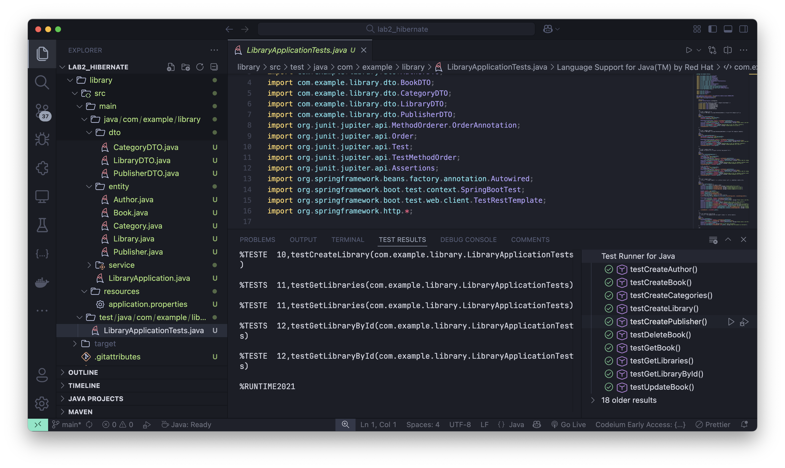

# Отчёт о разработке и тестировании Spring Boot приложения для управления библиотекой с использованием Hibernate

**Автор отчёта:** Никита Савка  
**Дата:** 14 марта 2025  
**Ссылка на репозиторий:** [https://github.com/NikitaBytes/Spring-assignments/tree/main/lab2_hibernate](https://github.com/NikitaBytes/Spring-assignments/tree/main/lab2_hibernate)

---

## Содержание
1. [Введение](#1-введение)  
2. [Структура проекта](#2-структура-проекта)  
3. [Краткое описание кода приложения](#3-краткое-описание-кода-приложения)  
4. [Подготовка к запуску проекта](#4-подготовка-к-запуску-проекта)  
5. [Запуск приложения и проверка](#5-запуск-приложения-и-проверка)  
6. [Интеграционные тесты](#6-интеграционные-тесты)  
7. [Выводы](#7-выводы)  
8. [Приложения и дополнительные материалы](#8-приложения-и-дополнительные-материалы)  

---

## 1. Введение

**Цель проекта:**  
Разработать Spring Boot приложение для управления библиотекой, которое реализует CRUD‑операции через REST API. В работе используется «чистый» Hibernate (без автоматической настройки Spring Data JPA) для взаимодействия с базой данных. При этом API работает с DTO, а не напрямую с JPA‑сущностями.

**Основные сущности и их связи:**  
- **Author** *Один автор может написать много книг (связь One-to-Many).*  
- **Publisher** *Один издатель может издать много книг (связь One-to-Many)*  
- **Book** *Каждая книга принадлежит одному автору и одному издателю (связи Many-to-One), а также может относиться к нескольким категориям (Many-to-Many)*  
- **Category** *Одна категория может быть связана с несколькими книгами (Many-to-Many)*  
- **Library** *Библиотека содержит коллекцию книг в виде списка идентификаторов, хранимых через аннотацию `@ElementCollection` (связь One-to-Many)*  

**Функционал:**  
- Реализация CRUD-операций через REST API.  
- Использование DTO вместо прямой работы с сущностями.  
- Создание интеграционных тестов для проверки работы приложения.  

**Отличие от первой лабораторной работы:**  
В отличие от первой лабораторной работы, где использовался чистый JPA с интерфейсами Spring Data JPA, в данной работе применяется Hibernate для непосредственного управления базой данных через DAO-классы. Это обеспечивает более гибкий контроль над запросами и связями между сущностями.

---

## 2. Структура проекта

Проект построен на основе Maven. Вот обновленная структура, отражающая использование Hibernate:

```plaintext
library/
├── src/
│   ├── main/
│   │   ├── java/
│   │   │   └── com/example/library/
│   │   │       ├── LibraryApplication.java
│   │   │       ├── config/
│   │   │       │   └── HibernateConfig.java
│   │   │       ├── controller/
│   │   │       │   ├── BookController.java
│   │   │       │   ├── ReferenceController.java
│   │   │       │   └── LibraryController.java
│   │   │       ├── dao/
│   │   │       │   ├── AuthorDao.java
│   │   │       │   ├── BookDao.java
│   │   │       │   ├── CategoryDao.java
│   │   │       │   ├── LibraryDao.java
│   │   │       │   └── PublisherDao.java
│   │   │       ├── dto/
│   │   │       │   ├── AuthorDTO.java
│   │   │       │   ├── BookDTO.java
│   │   │       │   ├── CategoryDTO.java
│   │   │       │   ├── LibraryDTO.java
│   │   │       │   └── PublisherDTO.java
│   │   │       ├── entity/
│   │   │       │   ├── Author.java
│   │   │       │   ├── Book.java
│   │   │       │   ├── Category.java
│   │   │       │   ├── Library.java
│   │   │       │   └── Publisher.java
│   │   │       └── service/
│   │   │           ├── BookService.java
│   │   │           ├── ReferenceService.java
│   │   │           └── LibraryService.java
│   │   └── resources/
│   │       └── application.properties
│   └── test/
│       └── java/
│           └── com/example/library/
│               └── LibraryApplicationTests.java
└── pom.xml
```

### Описание директорий:
- **`config/`**: Конфигурация Hibernate (например, настройка `SessionFactory`).  
- **`controller/`**: REST-контроллеры для обработки HTTP-запросов (остались без изменений).  
- **`dao/`**: DAO-классы для работы с базой данных через Hibernate (замена репозиториев из первой лабы).  
- **`dto/`**: DTO-классы для передачи данных через API (без изменений).  
- **`entity/`**: JPA-сущности с аннотациями связей (`@OneToMany`, `@ManyToOne`, `@ManyToMany`, `@ElementCollection`).  
- **`service/`**: Слой бизнес-логики приложения (минимальные изменения для работы с DAO).  
- **`resources/application.properties`**: Конфигурация базы данных, Hibernate и логгирования.  
- **`test/`**: Интеграционные тесты.  

---

## 3. Краткое описание кода приложения

### 3.1. Основной класс приложения
```java
@SpringBootApplication
public class LibraryApplication {
    public static void main(String[] args) {
        SpringApplication.run(LibraryApplication.class, args);
    }
}
```
Запускает приложение Spring Boot (без изменений).

### 3.2. Контроллеры
- **`BookController`**: Управление книгами через `/api/books`.  
- **`LibraryController`**: Управление библиотеками через `/api/libraries`.  
- **`ReferenceController`**: Управление справочниками через `/api/reference/{authors,publishers,categories}`.  
Контроллеры остались практически нетронутыми, так как они работают с сервисами, а не напрямую с данными.

### 3.3. Сервисы
- **`BookService`**: Логика работы с книгами (сохранение, удаление, поиск).  
- **`ReferenceService`**: CRUD для `Author`, `Publisher`, `Category`.  
- **`LibraryService`**: CRUD для `Library`.  
Сервисы адаптированы для работы с DAO вместо репозиториев, но изменения минимальны.

### 3.4. Сущности
| Сущность      | Поля                 | Связи                          |
|---------------|----------------------|--------------------------------|
| `Author`      | `id`, `name`         | `@OneToMany` → `Book`          |
| `Book`        | `id`, `title`        | `@ManyToOne` → `Author`, `Publisher`; `@ManyToMany` → `Category` |
| `Category`    | `id`, `name`         | `@ManyToMany` → `Book`         |
| `Library`     | `id`, `name`         | `@ElementCollection` → `bookIds` |
| `Publisher`   | `id`, `name`         | `@OneToMany` → `Book`          |

Сущности остались такими же, как в первой лабораторной работе, так как связи и аннотации JPA совместимы с Hibernate.

### 3.5. DAO-классы
Вместо интерфейсов Spring Data JPA теперь используются DAO-классы с прямым доступом к Hibernate `Session`. Пример для `BookDao`:

```java
@Repository
@Transactional
public class BookDao {
    @Autowired
    private SessionFactory sessionFactory;

    public Book save(Book book) {
        return sessionFactory.getCurrentSession().merge(book);
    }

    public Book findById(Long id) {
        return sessionFactory.getCurrentSession().get(Book.class, id);
    }

    public List<Book> findAll() {
        return sessionFactory.getCurrentSession().createQuery("from Book", Book.class).list();
    }

    public void delete(Book book) {
        sessionFactory.getCurrentSession().remove(book);
    }
}
```

### 3.6. DTO
DTO-классы остались без изменений, так как они не зависят от способа доступа к данным:  
Пример: `BookDTO` содержит `authorId`, `publisherId`, `categoryIds`.

---

## 4. Подготовка к запуску проекта

### 4.1. Настройка базы данных (MySQL)
Файл `application.properties` обновлен для Hibernate:

```properties
spring.datasource.url=jdbc:mysql://localhost:3306/library_db?useSSL=false&serverTimezone=UTC
spring.datasource.username=root
spring.datasource.password=root
spring.datasource.driver-class-name=com.mysql.cj.jdbc.Driver
spring.jpa.hibernate.ddl-auto=update
spring.jpa.show-sql=true
spring.jpa.properties.hibernate.format_sql=true
spring.jpa.properties.hibernate.dialect=org.hibernate.dialect.MySQL8Dialect
```

**Создание базы данных:**
```sql
CREATE DATABASE library_db;
```

---

## 5. Запуск приложения и проверка

### 5.1. Запуск через Maven
```bash
mvn clean install
mvn spring-boot:run
```

**Вывод в консоли:**
```
[INFO] --- spring-boot:3.4.2:run (default-cli) @ SPLab2 ---
  .   ____          _            
 /\\ / ___'_ __ _ _(_)_ __       
...
Tomcat started on port(s): 8080 (http)
Started LibraryApplication in 2.345 seconds
```

> **Скриншот:** Успешного запуска сервера.  
> 

### 5.2. Проверка REST-эндпоинтов
**Пример запросов через cURL (без изменений):**

- Получение списка книг:
  ```bash
  curl -X GET http://localhost:8080/api/books
  ```

- Создание книги:
  ```bash
  curl -X POST -H "Content-Type: application/json" \
  -d '{"title": "Тестовая книга 9999", "authorId": 1, "publisherId": 1, "categoryIds": [1, 2]}' \
  http://localhost:8080/api/books
  ```

- Создание автора:
  ```bash
  curl -X POST -H "Content-Type: application/json" \
    -d '{"name":"Иванов"}' \
    http://localhost:8080/api/reference/authors
  ```

> **Скриншот:** Работа REST-эндпоинтов.  
> 

---

## 6. Интеграционные тесты

### 6.1. Класс `LibraryApplicationTests.java`
Тесты остались аналогичными первой работе, но теперь проверяют работу с Hibernate:

```java
@SpringBootTest(webEnvironment = SpringBootTest.WebEnvironment.RANDOM_PORT)
class LibraryApplicationTests {
    @Autowired
    private TestRestTemplate restTemplate;

    @Test
    void testCreateAuthor() {
        AuthorDTO author = new AuthorDTO("Иванов");
        ResponseEntity<AuthorDTO> response = restTemplate.postForEntity("/api/reference/authors", author, AuthorDTO.class);
        Assertions.assertEquals(HttpStatus.CREATED, response.getStatusCode());
        Assertions.assertNotNull(response.getBody().getId());
    }
}
```

### 6.2. Запуск тестов

#### 6.2.1. Через Maven
```bash
mvn clean test
```

**Результат:**
```
[INFO] Results:
[INFO] Tests run: 10, Failures: 0, Errors: 0, Skipped: 0
[INFO] BUILD SUCCESS
```

> **Скриншот:** Результаты тестов в Maven.  
> 

#### 6.2.2. Через Visual Studio Code
1. Открыть `LibraryApplicationTests.java`.  
2. Нажать зелёный треугольник (Run).  

> **Скриншот:** Результаты тестов в Visual Studio Code.  
> 

---

## 7. Выводы

В ходе работы я:  
- Создал Maven-проект Spring Boot с пятью сущностями и их связями, используя Hibernate.  
- Реализовал REST-контроллеры и сервисы для CRUD-операций (с минимальными изменениями относительно первой лабы).  
- Настроил DTO для безопасной передачи данных.  
- Заменил репозитории Spring Data JPA на DAO-классы с использованием Hibernate `Session`.  
- Написал и провёл интеграционные тесты с использованием `TestRestTemplate` и JUnit Assertions.  
- Проверил корректность всех связей (`@OneToMany`, `@ManyToOne`, `@ManyToMany`, `@ElementCollection`).  

**Итог:** Задание выполнено полностью, функционал протестирован и работает корректно. Использование Hibernate позволило более гибко управлять запросами к базе данных по сравнению с чистым JPA, используемым в первой работе.

---

## 8. Приложения и дополнительные материалы

- **`application.properties`**: Конфигурация MySQL и Hibernate.  
- **`pom.xml`**: Зависимости: `spring-boot-starter-data-jpa`, `spring-boot-starter-web`, `mysql-connector-j`, `hibernate-core`.  
- Логи запуска и результаты тестов в `LibraryApplicationTests.java`.  
