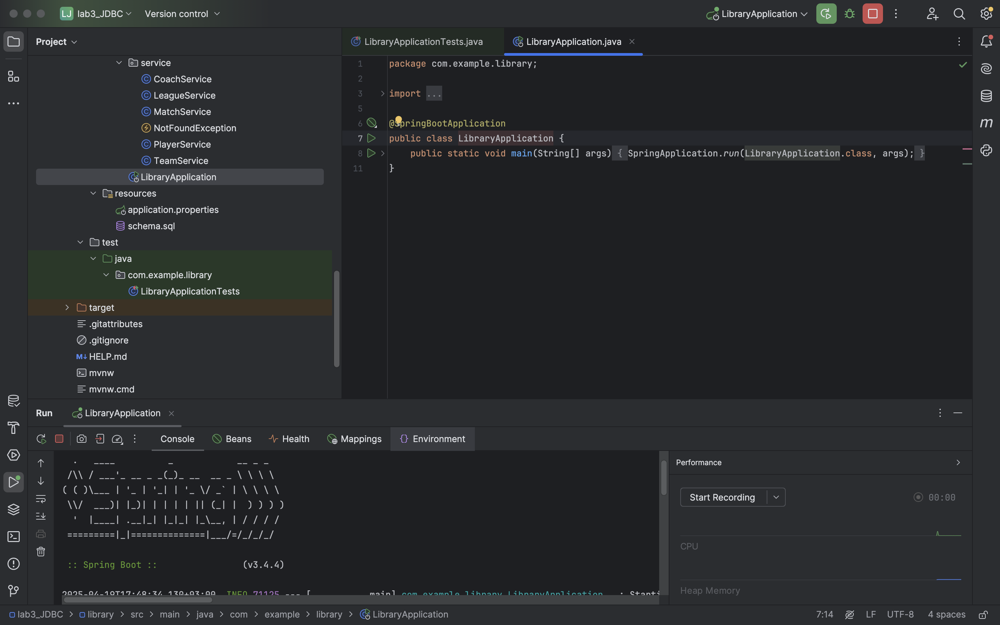
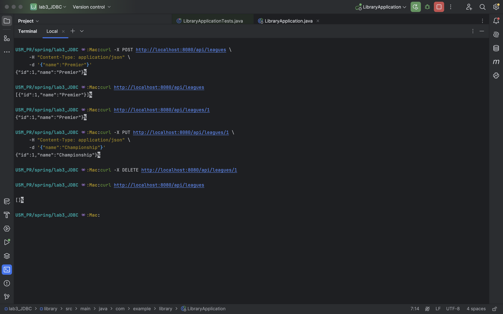
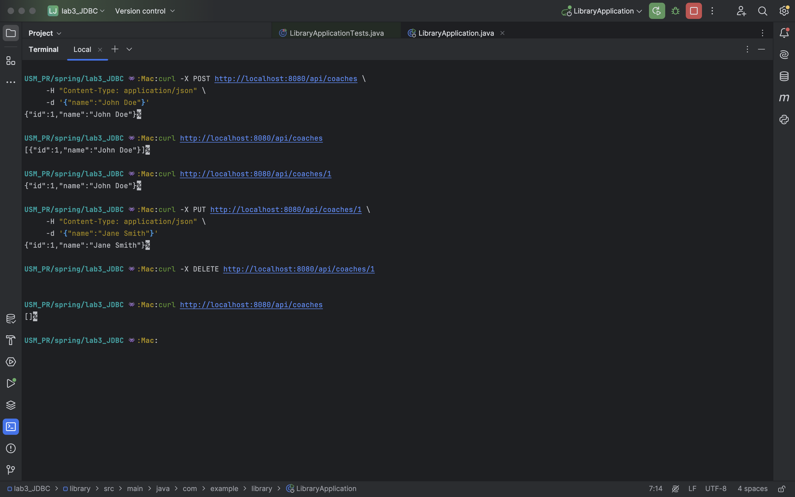
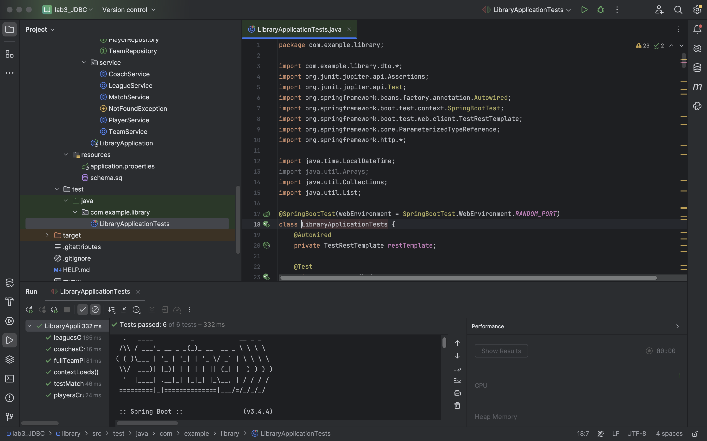

# Отчёт о разработке и тестировании Spring Boot‑приложения «Sports‑Library» на Spring JDBC

**Автор отчёта:** Никита Савка  
**Дата:** 19 апреля 2025  
**Ссылка на репозиторий:**  
https://github.com/NikitaBytes/Spring-assignments/tree/main/lab3_JDBC

---

## Содержание
1. [Введение](#1-введение)  
2. [Структура проекта](#2-структура-проекта)  
3. [Краткое описание кода](#3-краткое-описание-кода)  
4. [Подготовка и запуск](#4-подготовка-и-запуск)  
5. [Проверка REST‑API](#5-проверка-rest‑api)  
6. [Интеграционные тесты](#6-интеграционные-тесты)  
7. [Выводы](#7-выводы)  
8. [Приложения](#8-приложения)  

---

## 1. Введение

Цель лабораторной работы – разработать Spring Boot‑приложение для управления спортивной «библиотекой» (лиги ⇄ команды ⇄ игроки + матчи + тренеры) без Hibernate/JPA.  
Доступ к БД осуществляется через Spring JDBC (`JdbcTemplate`).  
Контроллеры и сервисы из предыдущих работ были переиспользованы и адаптированы для работы с `JdbcTemplate` вместо `JpaRepository`.

### 1.1. Сущности и связи

| Сущность | Поля                               | Связи                                              |
| :------- | :--------------------------------- | :-------------------------------------------------- |
| League   | id, name                           | One‑to‑Many → Team                                  |
| Coach    | id, name                           | One‑to‑Many → Team                                  |
| Team     | id, name, leagueId, coachId        | Many‑to‑One → League, Coach; One‑to‑Many → Player, Match |
| Player   | id, name, teamId                   | Many‑to‑One → Team                                  |
| Match    | id, homeTeamId, awayTeamId, date, homeScore, awayScore | Many‑to‑One → Team (две ссылки)                     |

### 1.2. Ключевые требования

- Spring JDBC вместо JPA/Hibernate (`JdbcTemplate`).  
- CRUD через REST API, работа исключительно с DTO.  
- DTO агрегируют всю связанную информацию (например, `TeamDTO` содержит `CoachDTO`, `LeagueDTO`, списки `PlayerDTO` и `MatchDTO`).  
- POST/PUT принимают только существующие ID связанных сущностей.  
- Валидация входных данных через `jakarta.validation` (`@NotBlank`, `@Size`, `@Positive`, `@Max`).  
- Ручная проверка существования связанных сущностей в сервисном слое (при отсутствии – `NotFoundException`).  

---

## 2. Структура проекта

```plaintext
library/
└── src/
    ├── main/
    │   ├── java/com/example/library/
    │   │   ├── LibraryApplication.java
    │   │   ├── config/JdbcConfig.java          ← создаёт JdbcTemplate
    │   │   ├── controller/                     ← REST‑контроллеры
    │   │   ├── dto/                            ← DTO с полной связанной инфо
    │   │   ├── model/                          ← POJO‑модели (не JPA)
    │   │   ├── repository/                     ← интерфейсы репозиториев
    │   │   │   ├── impl/                       ← JDBC‑реализации
    │   │   │   └── rowmapper/                  ← RowMapper’ы
    │   │   ├── service/                        ← бизнес‑логика + валидация ID
    │   │   └── controller/GlobalExceptionHandler.java
    │   └── resources/
    │       ├── application.properties
    │       └── schema.sql                      ← DDL + FK для MySQL
    └── test/java/com/example/library/
        └── LibraryApplicationTests.java       ← интеграционный тест (TestRestTemplate)
└── pom.xml
```

---

## 3. Краткое описание кода

### 3.1. Конфигурация JdbcTemplate

```java
// src/main/java/com/example/library/config/JdbcConfig.java
@Configuration
@EnableTransactionManagement
public class JdbcConfig {
    @Bean
    public JdbcTemplate jdbcTemplate(DataSource ds) {
        return new JdbcTemplate(ds);
    }
}
```

### 3.2. Пример JDBC‑репозитория

```java
// src/main/java/com/example/library/repository/impl/LeagueRepositoryImpl.java
@Repository
public class LeagueRepositoryImpl implements LeagueRepository {
    private final JdbcTemplate jdbc;
    public LeagueRepositoryImpl(JdbcTemplate jdbc) { this.jdbc = jdbc; }

    @Override
    public List<League> findAll() {
        return jdbc.query("SELECT id,name FROM leagues", new LeagueRowMapper());
    }
    // ... findById, create (with GeneratedKeyHolder), update, delete ...
}
```

### 3.3. DTO (фрагмент `TeamDTO`)

```java
// src/main/java/com/example/library/dto/TeamDTO.java
public class TeamDTO {
    private Long id;
    private String name;
    private CoachDTO coach;
    private LeagueDTO league;
    private List<PlayerDTO> players;
    private List<MatchDTO> matches;
    // ... геттеры/сеттеры ...
}
```

### 3.4. Сервис + валидация ID

```java
// src/main/java/com/example/library/service/TeamService.java
@Service
@Transactional
public class TeamService {
    // ... репозитории ...

    public TeamDTO create(TeamCreateUpdateDTO dto) {
        coachRepo.findById(dto.getCoachId());
        leagueRepo.findById(dto.getLeagueId());
        dto.getPlayerIds().forEach(playerRepo::findById);

        Team t = new Team(...);
        Long id = teamRepo.create(t);
        return findById(id);
    }
    // ... update, delete, toDTO, findTeamOrThrow ...
}
```

### 3.5. Глобальный обработчик ошибок

```java
// src/main/java/com/example/library/controller/GlobalExceptionHandler.java
@ControllerAdvice
public class GlobalExceptionHandler {
    // @ExceptionHandler для NotFoundException → 404
    // @ExceptionHandler для MethodArgumentNotValidException → 400
    // @ExceptionHandler для MethodArgumentTypeMismatchException → 400
    // @ExceptionHandler Exception → 500
}
```

---

## 4. Подготовка и запуск

1. Создать базу MySQL:
   ```sql
   mysql -u root -p -e 'CREATE DATABASE sports_db;'
   mysql -u root -p sports_db < library/src/main/resources/schema.sql
   ```
2. В `application.properties` указать:
   ```properties
   spring.datasource.url=jdbc:mysql://localhost:3306/sports_db?useSSL=false&serverTimezone=UTC
   spring.datasource.username=root
   spring.datasource.password=<your_password>
   spring.sql.init.mode=always
   spring.sql.init.schema-locations=classpath:schema.sql
   spring.sql.init.continue-on-error=true
   logging.level.org.springframework.jdbc.core=DEBUG
   ```
3. Запустить:
   ```bash
   mvn clean spring-boot:run
   ```

(все запускаются)

---

## 5. Проверка REST‑API

```bash
# 1) Создать тренера
curl -X POST http://localhost:8080/api/coaches \
     -H "Content-Type: application/json" \
     -d '{"name":"John Doe"}'

# 2) Получить список всех
curl http://localhost:8080/api/coaches

# 3) Получить одного по id
curl http://localhost:8080/api/coaches/1

# 4) Обновить
curl -X PUT http://localhost:8080/api/coaches/1 \
     -H "Content-Type: application/json" \
     -d '{"name":"Jane Smith"}'

# 5) Удалить
curl -X DELETE http://localhost:8080/api/coaches/1

# 1) Создать лигу
curl -X POST http://localhost:8080/api/leagues \
     -H "Content-Type: application/json" \
     -d '{"name":"Premier"}'

# 2) Список всех
curl http://localhost:8080/api/leagues

# 3) По id
curl http://localhost:8080/api/leagues/1

# 4) Обновить
curl -X PUT http://localhost:8080/api/leagues/1 \
     -H "Content-Type: application/json" \
     -d '{"name":"Championship"}'

# 5) Удалить
curl -X DELETE http://localhost:8080/api/leagues/1

# 1) Создать команду
curl -X POST http://localhost:8080/api/teams \
     -H "Content-Type: application/json" \
     -d '{
           "name":"Team A",
           "coachId":1,
           "leagueId":1,
           "playerIds":[]
         }'

# 2) Список всех
curl http://localhost:8080/api/teams

# 3) По id
curl http://localhost:8080/api/teams/1

# 4) Обновить (например, добавить игрока с id=2)
curl -X PUT http://localhost:8080/api/teams/1 \
     -H "Content-Type: application/json" \
     -d '{
           "name":"Team A",
           "coachId":1,
           "leagueId":1,
           "playerIds":[2]
         }'

# 5) Удалить
curl -X DELETE http://localhost:8080/api/teams/1

# 1) Создать матч (формат даты ISO‑8601)
curl -X POST http://localhost:8080/api/matches \
     -H "Content-Type: application/json" \
     -d '{
           "homeTeamId":1,
           "awayTeamId":2,
           "matchDate":"2025-04-19T18:00:00",
           "homeScore":2,
           "awayScore":3
         }'

# 2) Список всех
curl http://localhost:8080/api/matches

# 3) По id
curl http://localhost:8080/api/matches/1

```
(все запросы проходят)


---

## 6. Интеграционные тесты

- `LibraryApplicationTests.java` покрывает CRUD всех сущностей и комплексный сценарий:
  - Лига → тренер → команда → игроки → матч → проверка GET `/api/teams/{id}`.
- Запуск:
  ```bash
  mvn clean test
  ```
- Ожидается:
  ```
  Tests run: N, Failures: 0, Errors: 0, Skipped: 0
  ```

(все тесты проходят)
---

## 7. Выводы

- Перевёл проект с Hibernate/JPA на чистый Spring JDBC – репозитории переписаны, контроллеры/сервисы переиспользованы почти без правок.
- Репозитории переписаны с SQL‑запросами вручную.
- DTO расширены: каждое GET‑API возвращает всю связанную информацию (ID игроков, тренера, лиги, матчей).
- Работа через JdbcTemplate потребовала чуть больше кода (SQL‑запросы вручную), зато полный контроль над логикой и понятная трассировка запросов (DEBUG‑лог).
- Полный набор интеграционных тестов подтвердил корректность работы.

Итог: все требования лабораторной работы выполнены; приложение стабильно работает с MySQL, API протестирован автоматическими интеграционными тестами.
---

## 8. Приложения

- `schema.sql` (DDL со всеми FK)  
- `pom.xml` (зависимости Spring Boot, JDBC, Validation, Testcontainers)  
- Скриншоты в `images/` (запуск и результаты тестов)
